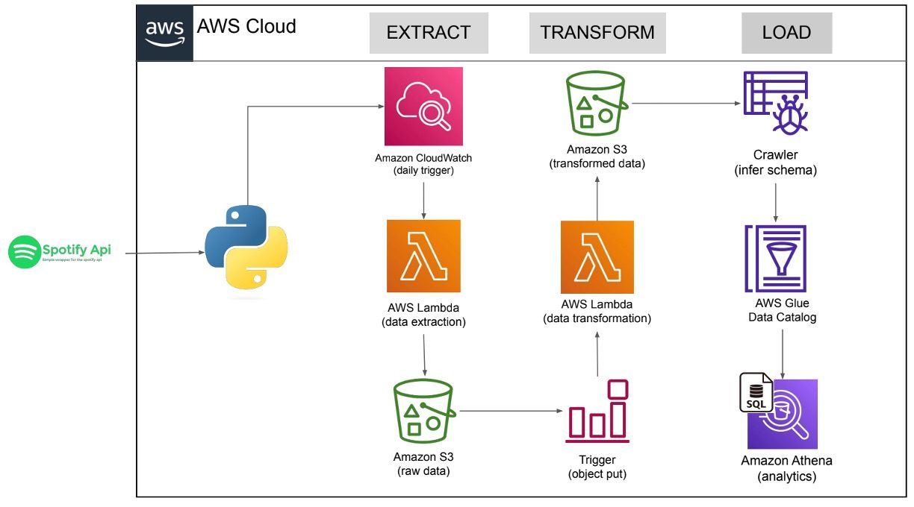

# Hamza Safwan
___
## Technical Skills
- Languages: Python, SQL, HTML, CSS, JavaScript
- Tools & Technologies: Django, Flask, React, Node, Tensorflow, Pytorch, LangChain, PowerBI,Airflow, Spark, Git, Docker, AWS
- Problem-Solving: [LeetCode](https://leetcode.com/hamzasafwan/), [Codeforces](codeforces.com), [AtCoder](atcoder.jp)

##  Final Year Project
___

### [GradeMate](https://github.com/safwanhamza/GradeMate)   
_LLMs, Langchain, FastAPI, React, Vector & Graph Databases, Docker_

- Working on a Generative AI web app for automated exam grading using NLP, LLMs, and advanced RAG techniques (Graph RAG, Query Expansion, Merged Retrieval, etc.)
- Developing a full-stack system with Django (backend) and React (frontend), for seamless AI-driven grading workflows.
- Leading a 4-member team, managing the codebase, project execution, and cross-functional coordination to deliver a high-impact AI solution.

## Other Projects

### [LegalEagle](https://github.com/safwanhamza/LegalEagle)
_Python, LLMs, LangChain, RAG, Django_

- Developed a RAG-powered contract review system using LangChain, and enabling interactive contract Q&A with accurate retrieval and generation.
- Focused on evaluating and refining RAG pipelines, enhancing response quality, and improving contract analysis efficiency.

### [Landmark Classification](https://github.com/safwanhamza/Landmark-Classification) 
_Tensorflow, OpenCV, Transfer Learning, VGG16, Streamlit_

- Developed a CNN-based landmark classification model using a subset of Google Landmarks Dataset to predict image locations for social media tagging.
- Optimized custom and transfer learning models, developing a user-friendly prediction interface for real-world applications.

### [Machine Translation](https://github.com/safwanhamza/Machine-Translation)
_TensorFlow, Keras, NLP, RNN, Transformers_

- Worked on Machine Translation using RNNs, GRUs, and Encoder-Decoder architectures.
- Implemented word embeddings, self-attention mechanisms, and sequence-to-sequence models.
  
### [Brain Tumor Detection](https://github.com/safwanhamza/Brain-Tumor-Detection)
_Tensorflow, OpenCV, CNN, Flask_

- Developed a deep learning model using Convolutional Neural Networks (CNNs) to detect brain tumors from MRI images.
- Deployed the model via a Flask web application, providing an accessible interface for medical image analysis.

### [Power BI](https://github.com/safwanhamza/Power-BI)
_Data Analysis, Business Intelligence, DAX_

- Created Power BI dashboards for data analysis and reporting of different problems.
- Worked on sales trends, customer churn, and road accident analysis, etc. to improve decision-making.
  
### [Spotify Data Pipeline](https://github.com/safwanhamza/spotify-data-engineering)
_APIs, Python, Airflow, ETL, AWS_

- Built an AWS-based data pipeline for processing Spotify data, using AWS Glue for ETL and storing optimized Parquet files in S3.
- Enabled fast querying with Amazon Athena and created Power BI visualizations for data-driven insights.

### [Sparkify Data Pipeline](https://github.com/safwanhamza/Sparkify-Data-Pipeline)
_APIs, PostgreSQL, Python, Airflow, Spark, ETL, AWS_

- Developed a data engineering workspace for a music streaming service, implementing data pipelines using PostgreSQL, Apache Cassandra, AWS Redshift, Apache Spark, and Apache Airflow.
- Designed and optimized ETL processes to handle large-scale user activity data, enabling efficient analytics and reporting.

### [MedSync](https://github.com/safwanhamza/MedSync)
_Python, Flask, SQL, REST APIs, React_

- Designed and developed a comprehensive system streamlining hospital operations and enhancing patient care.
- Implemented efficient management modules for doctors, patients, rooms, beds and other hospital resources reducing administrative burdens and improving resource allocation efficiently.

### [eCommerce](https://github.com/safwanhamza/eCommerce)
_Python, Django, SQL, REST APIs, React_

- Developed a full-stack eCommerce web app using Django and React, featuring user authentication, cart management, payments, and feedback functionality.
- Implemented admin controls for product management (add, edit, delete) and streamlined order processing for a fully functional shopping experience.

### [LittleLemon](https://github.com/safwanhamza/LittleLemon)
_Python, Django, SQL, REST APIs, React_

- Created a full-stack food business application, centralizing operations and elevating customer experiences.
- Implemented innovative features for efficient management, streamlining bookings, menus, pricing, and delivery services, boosting sales and reducing operational costs.  

## Contact
Feel free to reach out to me through the following channels:  
**** [hamzasafwan082@gmail.com](mailto:hamzasafwan082@gmail.com)  
**** [linkedin.com/in/hamzasafwan](https://linkedin.com/in/hamzasafwan)
